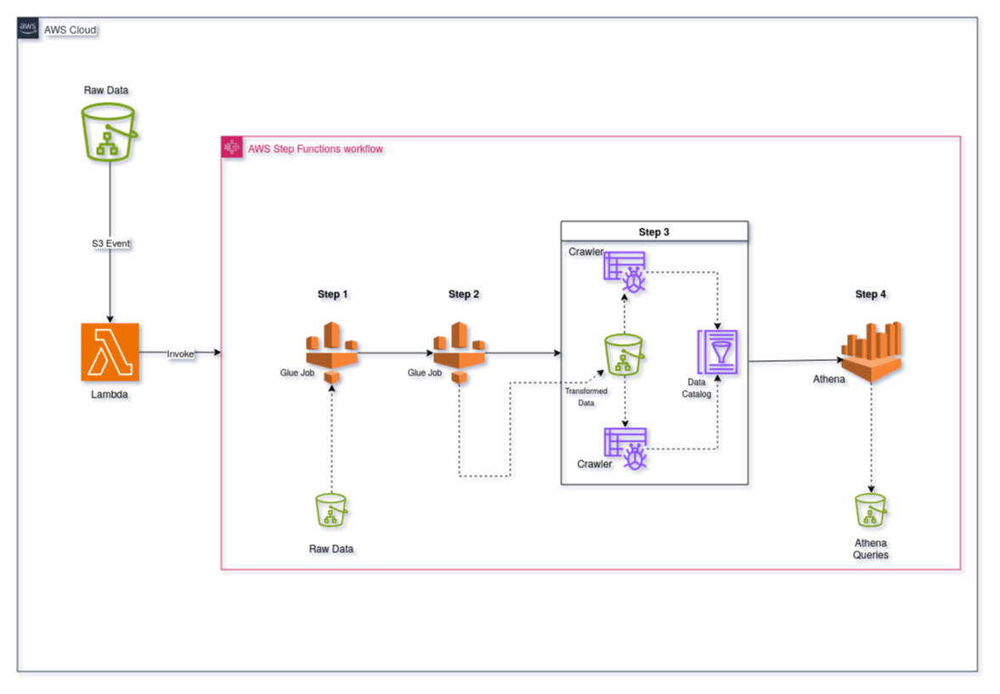
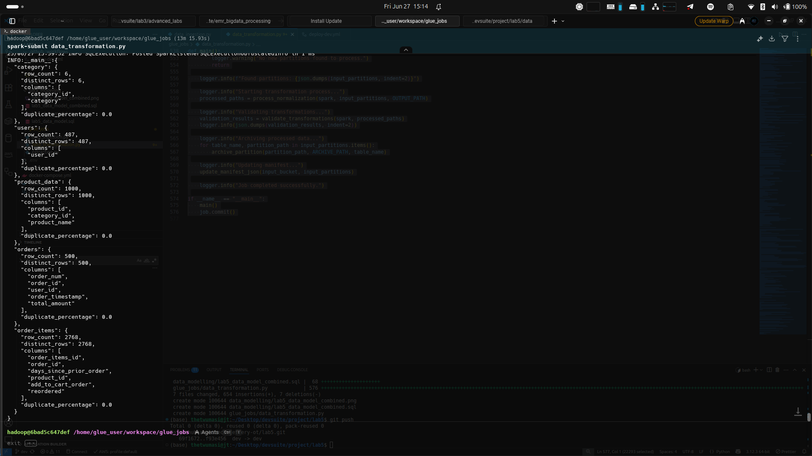

## Project: Lakehouse Architecture for E-Commerce Transactions

### Data Architecture

- local glue job to randomly generate raw data to s3 bucket
- s3 bucket sends event to lambda on data arrival which triggers step function
- glue job cleans, deduplicates and stores data as delta table file
- glue crawls delta file for native and symlink metadata tables (2 crawlers needed for each table)
- implement logging and bad records
- athena queries for table
- orchestrate whole flow with step function
- deploy with ci/cd github actions 

#### Gold Layer Metrics

